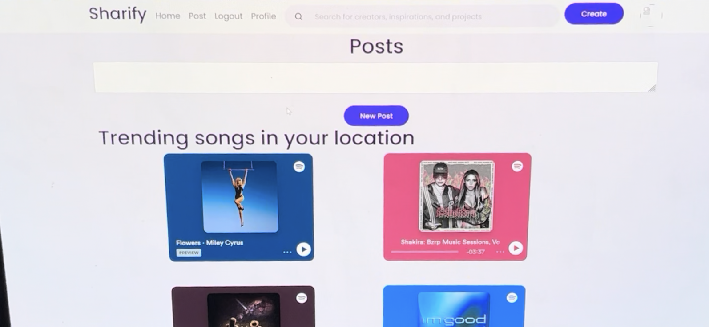
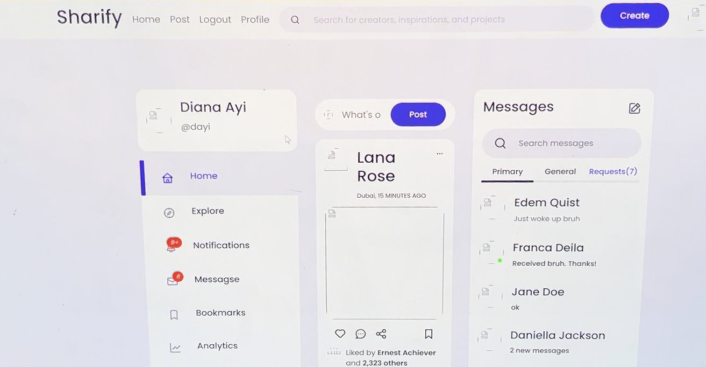
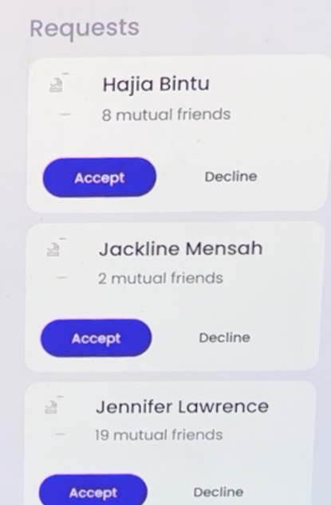
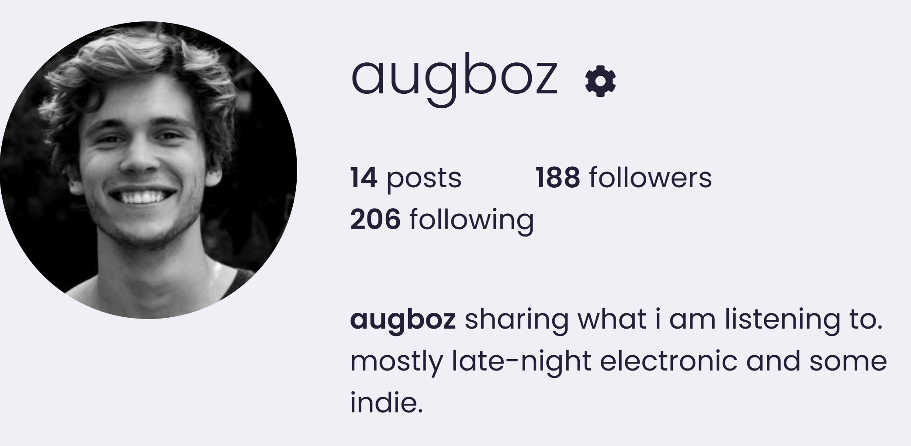
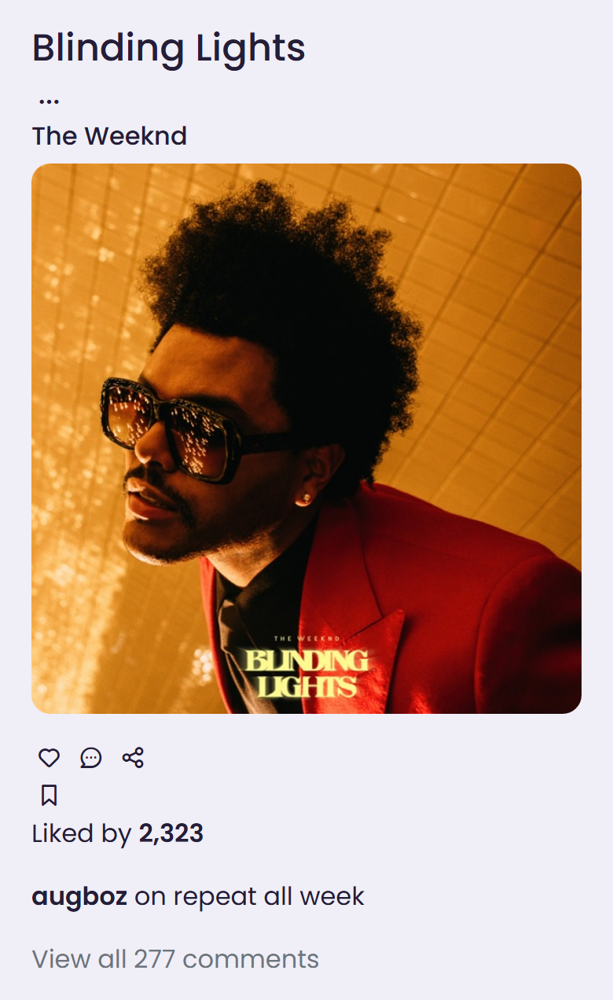
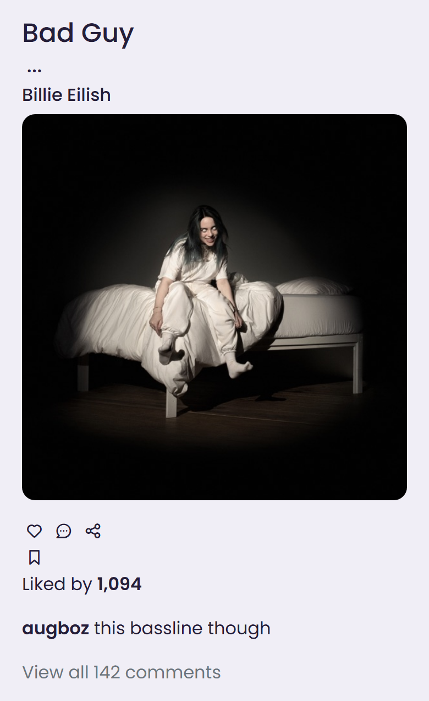

# Sharify

A social music app built on the **Spotify API**: share the songs you are
listening to, see what friends and people near you are playing, and follow each
other through a full social feed.

## Screenshots

### Trending songs near you
Location-based trending tracks, each with cover art and a 30-second Spotify
preview you can play inline.

### Home feed
A social feed with a sidebar (Home, Explore, Notifications, Messages, Bookmarks,
Analytics) and a direct-messages panel.

### Follow requests
A follow system with mutual-friend hints and accept or decline.

### Profile
Each profile shows post, follower, and following counts, a bio, and the user's
shared songs.

### Shared song posts
Posts are tracks: cover art, song and artist, likes, captions, and comments.

## Features
- **Spotify song sharing:** search the Spotify catalogue and post a track to your feed
- **Trending near you:** location-based trending songs with inline 30-second previews
- **Social feed:** likes, comments, captions, and a sidebar-driven layout
- **Follow system:** requests with mutual-friend hints and accept or decline
- **Direct messages:** primary, general, and request inboxes
- **Profiles:** post, follower, and following counts, a bio, and shared songs
- **Auth:** Spotify OAuth2 login

## Stack
- **Backend:** Python, Flask (app-factory pattern, see `website/`)
- **Data:** SQL, Spotify Web API
- **Auth:** OAuth2

## Run
The entry point is `main.py`, which builds the Flask app via
`website.create_app()`. You will need Spotify API credentials (client ID and
secret) configured as environment variables before running.

> Screenshots show the app running with sample data.
